# Esquema do Banco de Dados — Referência Técnica

> Gerado na Sprint 1.2 (Documento 14). Fonte da verdade: `supabase/migrations/`.
> Toda alteração de schema acontece **exclusivamente** via migração.

## Convenções

**Colunas padrão** — presentes em _todas_ as tabelas (omitidas do dicionário abaixo):

| Coluna                      | Tipo        | Descrição                                         |
| --------------------------- | ----------- | ------------------------------------------------- |
| `id`                        | uuid        | Chave primária (`gen_random_uuid()`)              |
| `created_at` / `updated_at` | timestamptz | Criação / última alteração (gatilho `touch_row`)  |
| `created_by` / `updated_by` | uuid        | Autor (FK `auth.users`)                           |
| `is_active`                 | boolean     | Soft delete — nunca excluir registros importantes |
| `version`                   | integer     | Incrementado automaticamente a cada UPDATE        |
| `notes`                     | text        | Observações livres                                |

**Mecânica transversal:**

- **Auditoria**: gatilho `audit_row` grava toda mudança em `audit_log` (quem, quando, o quê).
  O _motivo_ é informado pela aplicação: `set_config('app.change_reason', '...', true)`.
- **Versionamento com snapshot**: `strategies` e `reports` gravam o estado completo em
  `strategy_versions` / `report_versions` a cada insert/update — nada é sobrescrito.
- **RLS**: habilitada em todas as tabelas. Fase single-user: acesso completo para
  autenticados; políticas por `owner_id` virão na fase multi-user.
- **Origem protegida**: FKs de trilha de decisão (ex.: `strategies.diagnosis_session_id`)
  usam RESTRICT — uma sessão que originou estratégia não pode ser excluída fisicamente.
- **Comentários no banco**: toda tabela e coluna relevante possui `COMMENT ON` — o
  dicionário é consultável via `\d+` ou `information_schema`.

## Diagrama (relações principais)

```mermaid
erDiagram
    profiles ||--o{ students : "owner"
    students ||--o{ student_measurements : ""
    students ||--o{ student_photos : ""
    students ||--o{ student_documents : ""
    students ||--o{ student_goals : ""

    students ||--o{ diagnosis_sessions : ""
    diagnosis_sessions ||--o{ diagnosis_answers : ""
    diagnosis_sessions ||--o{ diagnosis_scores : ""
    diagnosis_sessions ||--o{ diagnosis_hypotheses : ""
    diagnosis_sessions ||--o{ diagnosis_risks : ""
    diagnosis_sessions ||--o{ diagnosis_opportunities : ""

    students ||--o{ strategies : ""
    diagnosis_sessions ||--o{ strategies : "origem"
    strategies ||--o{ strategy_versions : "snapshot"
    strategies ||--o{ strategy_alternatives : ""
    strategies ||--o{ strategy_decisions : ""
    strategies ||--o{ strategy_validations : ""

    strategies ||--o{ nutrition_targets : ""
    strategies ||--o{ macro_plans : ""
    macro_plans ||--o{ meal_structures : ""
    meal_structures ||--o{ meal_items : ""
    meal_items ||--o{ meal_substitutions : ""
    meal_structures ||--o{ meal_notes : ""

    food_sources ||--o{ foods : ""
    food_categories ||--o{ foods : ""
    foods ||--|| food_attributes : ""
    foods ||--o{ food_portions : ""
    foods ||--o{ food_substitutions : ""
    foods ||--o{ food_tag_assignments : ""
    food_tags ||--o{ food_tag_assignments : ""
    foods ||--o{ meal_items : ""

    supplements ||--o{ supplement_protocols : ""
    supplements ||--o{ supplement_indications : ""
    supplements ||--o{ supplement_contraindications : ""
    supplements ||--o{ supplement_evidence : ""

    students ||--o{ roadmaps : ""
    strategies ||--o{ roadmaps : ""
    roadmaps ||--o{ roadmap_phases : ""
    roadmaps ||--o{ roadmap_events : ""
    roadmaps ||--o{ roadmap_adjustments : ""

    students ||--o{ followups : ""
    strategies ||--o{ followups : ""
    followups ||--o{ followup_answers : ""
    followups ||--o{ followup_adjustments : ""
    followups ||--o{ followup_progress : ""

    students ||--o{ reports : ""
    strategies ||--o{ reports : ""
    reports ||--o{ report_versions : "snapshot"
    reports ||--o{ report_exports : ""

    ai_prompts ||--o{ ai_prompt_versions : ""
    ai_prompts ||--o{ ai_outputs : ""
    ai_outputs ||--o{ ai_reasoning_logs : ""
    ai_outputs ||--o{ ai_recommendations : "origem"
    students ||--o{ ai_recommendations : ""
```



## Dicionário de Dados

### Infra — `audit_log`

Trilha imutável (sem update/delete): `table_name`, `record_id`, `action`
(insert/update/delete), `changed_by`, `changed_at`, `old_data`/`new_data` (jsonb), `reason`.

### Domain: Students

| Tabela                 | Campos próprios                                                                                                                                         |
| ---------------------- | ------------------------------------------------------------------------------------------------------------------------------------------------------- |
| `students`             | `owner_id` (profissional), `full_name`, `sex`, `birth_date`, `height_cm`, `main_goal`, `email`, `phone`, `photo_url`, `status` (active/paused/archived) |
| `student_measurements` | `student_id`, `measured_at`, `weight_kg`, `body_fat_pct`, `circumferences`/`skinfolds`/`bioimpedance` (jsonb)                                           |
| `student_photos`       | `student_id`, `taken_at`, `storage_path`, `angle` (front/side/back/other), `caption`                                                                    |
| `student_documents`    | `student_id`, `title`, `document_type` (exam/report/prescription/other), `storage_path`, `issued_at`                                                    |
| `student_goals`        | `student_id`, `goal_type` (7 objetivos), `description`, `target_value`/`target_unit`, `deadline`, `priority` (1=principal), `status`                    |

### Domain: Diagnosis

| Tabela                    | Campos próprios                                                                                                                                               |
| ------------------------- | ------------------------------------------------------------------------------------------------------------------------------------------------------------- |
| `diagnosis_sessions`      | `student_id`, `status` (draft/in_progress/completed/reviewed), `started_at`, `completed_at`, `executive_summary`, `overall_confidence` (0–100)                |
| `diagnosis_answers`       | `session_id`, `block` (20 blocos do 03A), `question_key`†, `question_text`, `answer` (jsonb), `answer_state` (estados do Doc 07), `confidence`, `answered_at` |
| `diagnosis_scores`        | `session_id`, `score_key`† (adherence, organization...), `score` (0–100), `rationale`                                                                         |
| `diagnosis_hypotheses`    | `session_id`, `hypothesis`, `justification`, `confidence` (0–100), `expected_impact`, `preventive_plan`, `status` (active/validated/discarded)                |
| `diagnosis_risks`         | `session_id`, `risk_type` (Motor de Risco Doc 00), `description`, `severity`, `probability`, `mitigation` (risco sempre com solução)                          |
| `diagnosis_opportunities` | `session_id`, `description`, `expected_impact`, `effort` (low/moderate/high), `priority`                                                                      |

† único por sessão.

### Domain: Strategy

| Tabela                  | Campos próprios                                                                                                                                                                                                 |
| ----------------------- | --------------------------------------------------------------------------------------------------------------------------------------------------------------------------------------------------------------- |
| `strategies`            | `student_id`, `diagnosis_session_id` (origem, RESTRICT), `objective`, `speed` (5 velocidades Doc 04), `food_philosophy`, `flexibility_level`, `meals_per_day`, `justification`, `status`, `starts_at`/`ends_at` |
| `strategy_versions`     | `strategy_id`, `version_number`†, `snapshot` (jsonb completo), `change_reason` — preenchida por gatilho                                                                                                         |
| `strategy_alternatives` | `strategy_id`, `name`, `description`, `rejection_reason`, `adherence_probability`, `risks`                                                                                                                      |
| `strategy_decisions`    | `strategy_id`, `decision_key` (etapa do Doc 04), `problem`, `decision`, `justification`, `alternatives_considered`, `risks`, `mitigation` — o Banco de Decisões (Doc 01)                                        |
| `strategy_validations`  | `strategy_id`, `validation_key`† (checklist de autocrítica 03C/04), `passed`, `rationale`                                                                                                                       |

### Domain: Nutrition

| Tabela               | Campos próprios                                                                                                                                                             |
| -------------------- | --------------------------------------------------------------------------------------------------------------------------------------------------------------------------- |
| `nutrition_targets`  | `strategy_id`, `target_key`† (ex.: protein_g_per_kg), `target_value`, `target_unit`, `justification`                                                                        |
| `macro_plans`        | `strategy_id`, `plan_type`† (standard/training_day/rest_day/refeed/diet_break/weekend/travel), `calories_kcal`, `protein_g`, `carbs_g`, `fat_g`, `fiber_g`, `justification` |
| `meal_structures`    | `macro_plan_id`, `position`†, `name`, `scheduled_time`, `objective`                                                                                                         |
| `meal_items`         | `meal_structure_id`, `food_id`, `quantity_grams`, `household_measure`                                                                                                       |
| `meal_substitutions` | `meal_item_id`, `substitute_food_id`, `quantity_grams`, `household_measure`, `reason`                                                                                       |
| `meal_notes`         | `meal_structure_id`, `note_type` (general/preparation/timing/behavior), `content`                                                                                           |

### Domain: Foods

| Tabela                               | Campos próprios                                                                                                                                                                                                                        |
| ------------------------------------ | -------------------------------------------------------------------------------------------------------------------------------------------------------------------------------------------------------------------------------------- |
| `food_sources`                       | `name` (TBCA/TACO/USDA/Estimativa — seed incluído), `priority` (1=TBCA), `url`, `description`                                                                                                                                          |
| `food_categories`                    | `name`, `parent_id` (hierarquia), `description`                                                                                                                                                                                        |
| `foods`                              | `name`, `category_id`, `source_id`+`source_code` (origem rastreável), `energy_kcal`, `protein_g`, `carbs_g`, `fat_g`, `fiber_g` (por 100 g), `micronutrients` (jsonb); índice full-text em português                                   |
| `food_attributes`                    | 1:1 com `foods`: `satiety_score`, `practicality_score`, `digestibility_score` (0–100), `prep_time_minutes`, `freezes_well`, `portability`, `purchase_ease`, `cost_range`, `best_times[]`, `suitable_goals[]`, `strategic_applications` |
| `food_portions`                      | `food_id`, `name`† (medida caseira), `grams`                                                                                                                                                                                           |
| `food_substitutions`                 | `food_id`, `substitute_food_id` (≠, único par), `ratio`, `context`                                                                                                                                                                     |
| `food_tags` / `food_tag_assignments` | catálogo de tags estratégicas + associação N:N                                                                                                                                                                                         |

### Domain: Supplements

| Tabela                         | Campos próprios                                                                                                                                |
| ------------------------------ | ---------------------------------------------------------------------------------------------------------------------------------------------- |
| `supplements`                  | `name`, `objective`, `problem_solved`, `mechanism`, `usual_dose`, `timing`, `food_alternatives`, `expected_impact`, `priority`, `cost_benefit` |
| `supplement_protocols`         | `supplement_id`, `name`, `dose`, `schedule`, `duration`, `target_context`                                                                      |
| `supplement_indications`       | `supplement_id`, `indication`, `rationale`                                                                                                     |
| `supplement_contraindications` | `supplement_id`, `contraindication`, `severity` (mild/moderate/severe), `rationale`                                                            |
| `supplement_evidence`          | `supplement_id`, `evidence_level` (strong/moderate/limited/expert_opinion), `summary`, `reference_url`, `reviewed_at`                          |

### Domain: Roadmap

| Tabela                | Campos próprios                                                                                                                             |
| --------------------- | ------------------------------------------------------------------------------------------------------------------------------------------- |
| `roadmaps`            | `student_id`, `strategy_id`, `objective`, `current_phase` (7 fases Doc 03E), `status`                                                       |
| `roadmap_phases`      | `roadmap_id`, `phase`, `position`†, `objective`, `success_criteria`, `starts_at`/`ends_at`, `status` (pending/active/completed/**skipped**) |
| `roadmap_events`      | `roadmap_id`, `event_type` (travel/carnival/christmas/wedding...), `name`, `event_date`, `preparation_plan` (antecipação), `impact_notes`   |
| `roadmap_adjustments` | `roadmap_id`, `phase_id`, `adjustment`, `reason`, `expected_impact`, `applied_at`                                                           |

### Domain: Follow Up

| Tabela                 | Campos próprios                                                                                                                   |
| ---------------------- | --------------------------------------------------------------------------------------------------------------------------------- |
| `followups`            | `student_id`, `strategy_id`, `followup_date`, `weight_kg`, scores 0–100 (`adherence`/`hunger`/`sleep`/`energy`/`mood`), `summary` |
| `followup_answers`     | `followup_id`, `question_key`†, `question_text`, `answer` (jsonb)                                                                 |
| `followup_adjustments` | `followup_id`, `adjustment`, `reason`, `expected_impact`, `observed_result` (fecha o ciclo PNI)                                   |
| `followup_progress`    | `followup_id`, `metric_key`†, `metric_value`, `metric_unit`, `trend` (improving/stable/worsening)                                 |

### Domain: Reports

| Tabela            | Campos próprios                                                                                                                                    |
| ----------------- | -------------------------------------------------------------------------------------------------------------------------------------------------- |
| `reports`         | `student_id`, `strategy_id`, `report_type` (full_strategy/followup/adjustment/custom), `title`, `status` (draft/final/archived), `content` (jsonb) |
| `report_versions` | `report_id`, `version_number`†, `content`, `change_reason` — preenchida por gatilho                                                                |
| `report_exports`  | `report_id`, `report_version_number`, `format` (pdf/html), `storage_path`, `exported_at`                                                           |

### Domain: Knowledge Base

| Tabela                     | Campos próprios                                                                                                      |
| -------------------------- | -------------------------------------------------------------------------------------------------------------------- |
| `kb_articles`              | `title`, `slug` (único), `category`, `summary`, `content`, `evidence_level`, `tags[]`, `last_reviewed_at`            |
| `kb_protocols`             | `name`, `protocol_type` (plateau/low_adherence/excessive_hunger...), `trigger_conditions`, `steps`, `evidence_level` |
| `kb_food_guides`           | `title`, `context` (travel/restaurant/delivery/weekend...), `content`, `tags[]`                                      |
| `kb_supplement_guides`     | `title`, `supplement_id`, `content`, `evidence_level`                                                                |
| `kb_behavior_guides`       | `title`, `behavior_type` (binge_eating/snacking/emotional_hunger...), `content`, `strategies`                        |
| `kb_scientific_references` | `title`, `authors`, `journal`, `publication_year`, `doi`, `url`, `summary`, `evidence_level`                         |

### Domain: AI

| Tabela               | Campos próprios                                                                                                                                                              |
| -------------------- | ---------------------------------------------------------------------------------------------------------------------------------------------------------------------------- |
| `ai_prompts`         | `name` (único), `objective`, `inputs`/`outputs` (jsonb), `current_version`                                                                                                   |
| `ai_prompt_versions` | `prompt_id`, `version_number`†, `template`, `change_notes`                                                                                                                   |
| `ai_outputs`         | `prompt_id`+`prompt_version_number`, `student_id`, `context`/`output` (jsonb), `model`, `tokens_input`/`tokens_output`, `latency_ms`                                         |
| `ai_reasoning_logs`  | `ai_output_id`, `step`†, `reasoning` — alimenta o AI Strategy Panel                                                                                                          |
| `ai_recommendations` | `student_id`, `source_output_id`, `recommendation`, `justification`, `status` (pending/accepted/rejected/superseded), `decided_by`, `decided_at` — a IA nunca decide sozinha |

## Testes

`supabase/tests/database.test.sql` — 17 testes de integridade (inserção, versionamento,
soft delete, auditoria com motivo, FKs, checks, unicidade, cascades contidos, snapshots).

```bash
npm run db:test   # requer DATABASE_URL apontando para um banco de teste
```

Para PostgreSQL puro (sem Supabase), aplicar antes `supabase/tests/local-bootstrap.sql`,
que emula o schema `auth` mínimo.
